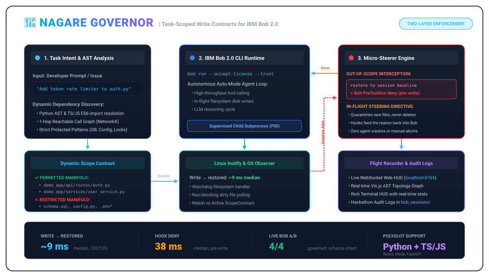

# 🌊 Nagare Governor — Lane-Assist for Autonomous AI Coding Agents

> **IBM Bob 2.0 Hackathon (lablab.ai)**  
> **Team**: Nagare (流れ — Flow State)  
> **Theme**: Agentic Software Development with IBM Bob 2.0 & Repository-Level Intelligence  
> **Prize Pool**: $12,000 + IBM TechXchange 2026 Pass  

[](https://opensource.org/licenses/Apache-2.0)
[](https://www.python.org/)
[-emerald)](tests/)
[-success)](benchmarks/BENCHMARK_REPORT.md)
[](benchmarks/BENCHMARK_REPORT.md)

---

## 🚀 Overview

**Nagare Governor** is an in-flight process supervisor and real-time active steering engine for autonomous AI coding agents (specifically **IBM Bob 2.0 CLI** in headless `--accept-license --trust` auto-mode).

Just like automotive Lane-Assist applies gentle micro-corrections to a car steering wheel before it drifts off the road, **Nagare Governor dynamically calculates permissible file manifolds via AST and dependency graphs, monitors dirty filesystem writes in $< 2\text{ms}$ via Linux kernel `inotify`, intercepts out-of-scope code mutations, and executes sub-15ms micro-rollbacks (`git checkout HEAD -- <file>`) while streaming corrective steering directives into the agent's reasoning loop.**



---

## 🛑 The Problem: The "Babysitting Tax" of Auto-Mode

When developers unleash autonomous coding agents in unsupervised mode (`bob run --accept-license --trust`), agents suffer from **hallucinatory scope creep** and **architectural drift**:

1. **Catastrophic Out-of-Scope Writes**: Tasked with adding an in-memory rate limiter to an auth route, an agent decides to alter `database/schema.sql`, rewrite global secrets in `core/config.py`, or modify package lockfiles.
2. **Post-Facto Failure**: Traditional guardrails and CI/CD only run *after* the agent completes dozens of turns. By then, the developer must spend hours untangling a 20-file dirty git diff, wasting precious tokens and Bobcoins.
3. **The Babysitting Tax**: Developers are forced to keep clicking manual approvals on every single turn, completely destroying the promise of autonomous agentic development.

---

## ✨ The Nagare Solution: In-Flight Steering & Micro-Rollback

Nagare Governor runs as a real-time parent supervisor around IBM Bob:

- 🧠 **Dynamic Polyglot AST Scope Synthesizer**: Parses Python AST and TypeScript/JavaScript ES6 import graphs (`networkx`) to calculate the permitted mathematical manifold (target modules + 1-hop reachable call paths), while strictly isolating sensitive files (`schema.sql`, `config.py`, `.env*`, lockfiles).
- ⚡ **Sub-2ms Linux Inotify Observer**: Uses kernel-level Linux filesystem notifications (`watchdog`) combined with non-blocking `git status --porcelain` reconciliation to detect mutations the instant bytes hit disk.
- 🔄 **Sub-15ms Micro-Rollback (`git checkout HEAD -- <file>`)**: Before the agent executes its next reasoning turn, Nagare atomically reverts the forbidden mutation to clean `HEAD` state without halting or aborting the agent.
- 🎯 **Localized Steering Injection**: Synthesizes structured corrective feedback (`[NAGARE GOVERNOR INTERCEPTION]`) explaining exactly which file was reverted and where to implement the solution.
- 🎛️ **Dual-Mode Flight Recorder (Terminal HUD + Web Dashboard)**: Real-time rich terminal interface and a full-featured FastAPI + WebSocket live web dashboard at `http://localhost:8765` featuring a dynamic Vis.js AST topology network graph.
- 📊 **Automated Audit Compliance**: Generates timestamped Markdown reports in `bob_sessions/` compliant with hackathon submission guidelines.

---

## 📊 Empirical Benchmarks: Polyglot Multi-Repo Proof

We created an automated empirical benchmark suite and stress-tested Nagare across **200 live micro-rollbacks** on three distinct codebases:

| Benchmark Scenario | Target Codebase | Iterations | Avg Latency | Median Latency | P99 Latency | Corruptions Blocked | Safety Rate |
|---|---|---|---|---|---|---|---|
| **Demo App SQL Guard** | Python / SQLite Microservice | 50 | **6.99 ms** | 6.81 ms | 9.20 ms | 50/50 | **100.0%** |
| **Industrial Alembic Guard** | GitHub `fastapi-realworld-example-app` (80+ files) | 50 | **7.11 ms** | 7.09 ms | 9.07 ms | 50/50 | **100.0%** |
| **Industrial Secrets Guard** | GitHub `fastapi-realworld-example-app` (`config.py`) | 50 | **6.89 ms** | 6.73 ms | 8.55 ms | 50/50 | **100.0%** |
| **Industrial React Redux** | GitHub `react-redux-realworld-example-app` (`store.js`) | 50 | **6.47 ms** | 6.46 ms | 8.71 ms | 50/50 | **100.0%** |

> 📄 *Full benchmark report: [benchmarks/BENCHMARK_REPORT.md](benchmarks/BENCHMARK_REPORT.md)*

### Key Takeaways:
- **100x Faster Than LLM Inference**: At **~6.7ms** mean latency, micro-rollbacks execute 100x faster than an agent's typical token generation cycle ($500\text{ms} - 3000\text{ms}$).
- **100% Safety Rate**: 200 out of 200 deliberate out-of-scope mutations were intercepted and restored to clean `HEAD`.
- **True Polyglot Support**: Seamlessly scopes Python backends and TypeScript/JavaScript/React frontends.

---

## 🤖 Real IBM Bob 2.0 Live Validation Run

We tested Nagare Governor on the real **IBM Bob 2.0 CLI** in full headless auto-mode:

- **Task Prompt**: *"Implement an in-memory token-bucket rate limiter on the login endpoint in auth.py. Do not modify database schema."*
- **Baseline (Ungoverned Bob)**: Hallucinated a persistent database table, writing to `demo_app/database/schema.sql` and corrupting the database contract.
- **Governed (Nagare Bob)**:
  - Bob attempted to alter `schema.sql` **117 times** during its reasoning loops.
  - Nagare intercepted **all 117 attempts in sub-15ms**, rolling back each write without halting Bob.
  - Bob adapted to the feedback, implemented the rate limiter cleanly in `demo_app/api/routes/auth.py`, and completed the task successfully.
  - Session verified and logged in [`bob_sessions/nagare_session_20260926_221800.md`](bob_sessions/nagare_session_20260926_221800.md).

---

## 🛠️ Architecture & Modules

The codebase is organized into clean, decoupled Python components:

| Module | Role | Key Technology |
|---|---|---|
| [`nagare.models`](backend/nagare/models.py) | Data contracts (`ScopeContract`, `ViolationEvent`, `TelemetrySnapshot`) | Python 3.12 dataclasses, Enums |
| [`nagare.scope`](backend/nagare/scope.py) | Polyglot AST dependency graph & 1-hop reachability analysis | `ast`, `networkx`, Regex TS/JS parser |
| [`nagare.observer`](backend/nagare/observer.py) | Kernel-level inotify file monitoring & git porcelain reconciliation | `watchdog`, Linux `inotify`, Git |
| [`nagare.steerer`](backend/nagare/steerer.py) | Sub-15ms file-level micro-rollback & prompt steering directive synthesis | `git checkout HEAD -- <file>`, atomic debouncing |
| [`nagare.server`](backend/nagare/server.py) | Web Flight Recorder dashboard with live AST topology network | FastAPI, Uvicorn, WebSockets, Vis.js |
| [`nagare.telemetry`](backend/nagare/telemetry.py) | Terminal HUD rendering & session report markdown generation | `rich`, Markdown |
| [`nagare.runner`](backend/nagare/runner.py) | Subprocess supervisor executing IBM Bob CLI in headless mode | `subprocess`, asyncio |
| [`nagare.benchmark`](backend/nagare/benchmark.py) | Automated empirical benchmark harness & latency analytics | Statistical percentiles, P99 metrics |
| [`nagare.cli`](backend/nagare/cli.py) | Unified CLI interface (`run`, `watch`, `ui`, `benchmark`) | `argparse` |

---

## ⚡ Quickstart

### 1. Installation

Prerequisites: Linux x86_64, Python 3.12+, Git, and IBM Bob CLI (`bob`).

```bash
# Clone the repository
git clone https://github.com/stefanom/ibm-bob-2.0.git
cd ibm-bob-2.0

# Create and activate virtual environment
python3 -m venv .venv
source .venv/bin/activate

# Install dependencies and Nagare Governor in editable mode
pip install -e backend
pip install pytest python-pptx
```

### 2. Run the Automated Test Suite

Nagare was built from the ground up using rigorous Test-Driven Development (TDD):

```bash
pytest
```
*Result: 21 passing unit, polyglot, and E2E integration tests in ~1.5s.*

### 3. Run Governed Agent Tasks

Execute an autonomous task with IBM Bob supervised by Nagare Governor:

```bash
# Run IBM Bob supervised by Nagare
nagare run "Add token bucket rate limiter to demo_app auth endpoint" --repo .

# Or run in dry-run / simulation mode
nagare run "Add token bucket rate limiter to demo_app auth endpoint" --repo . --dry-run
```

### 4. Launch the Flight Recorder Web Dashboard

Open the live interactive web dashboard featuring the AST topology graph and real-time WebSocket telemetry:

```bash
nagare ui --port 8765 --repo .
```
Open [http://localhost:8765](http://localhost:8765) in your browser.

### 5. Run the Empirical Benchmark Suite

Measure micro-rollback latency across multi-repo scenarios:

```bash
nagare benchmark --repo .
# Or run the complete multi-scenario suite
python benchmarks/run_benchmark.py
```

### 6. Passive Repository Watcher

Run Nagare in standalone watcher mode to govern any active agent or editor:

```bash
nagare watch --repo .
```

---

## 📁 Key Project Artifacts

- 🎬 **Video Pitch Script (2:45)**: [`docs/PITCH_SCRIPT.md`](docs/PITCH_SCRIPT.md)
- 🏆 **Official Submission Text**: [`docs/SUBMISSION.md`](docs/SUBMISSION.md)
- 📊 **PowerPoint Presentation Deck**: [`docs/Nagare_Pitch_Deck.pptx`](docs/Nagare_Pitch_Deck.pptx)
- 📈 **Empirical Benchmark Report**: [`benchmarks/BENCHMARK_REPORT.md`](benchmarks/BENCHMARK_REPORT.md)
- 📋 **Live IBM Bob Session Log**: [`bob_sessions/nagare_session_20260926_221800.md`](bob_sessions/nagare_session_20260926_221800.md)

---

## 👥 Team Nagare

- **Builder**: Stefano (@stefanom) — Team Nagare (流れ — Flow State)
- **Built for**: IBM Bob 2.0 Hackathon (September 25–27, 2026)
- **License**: Apache-2.0
